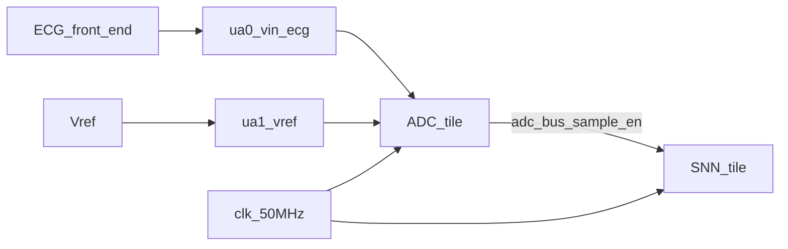
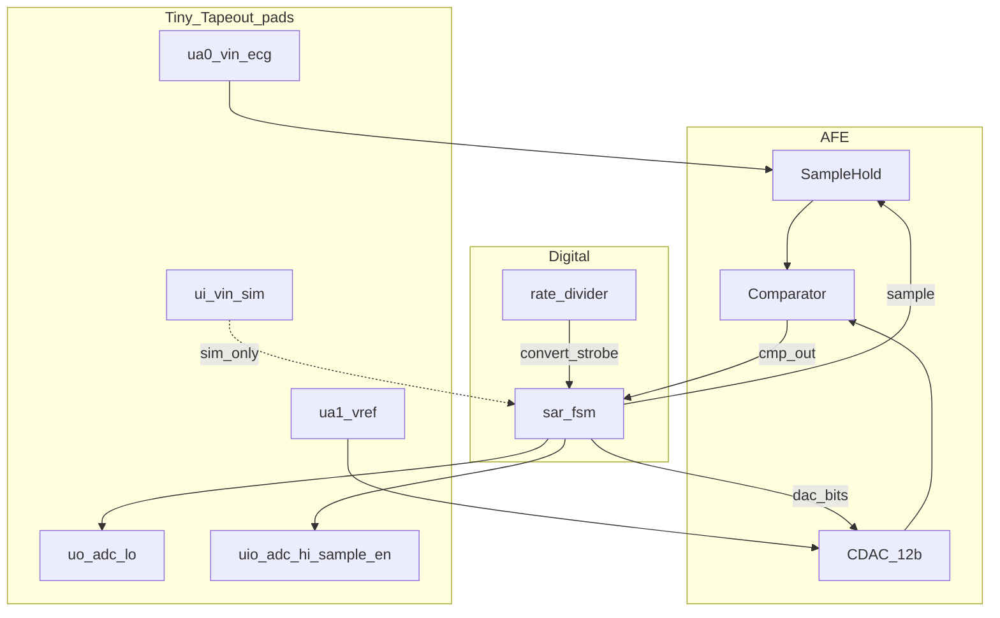
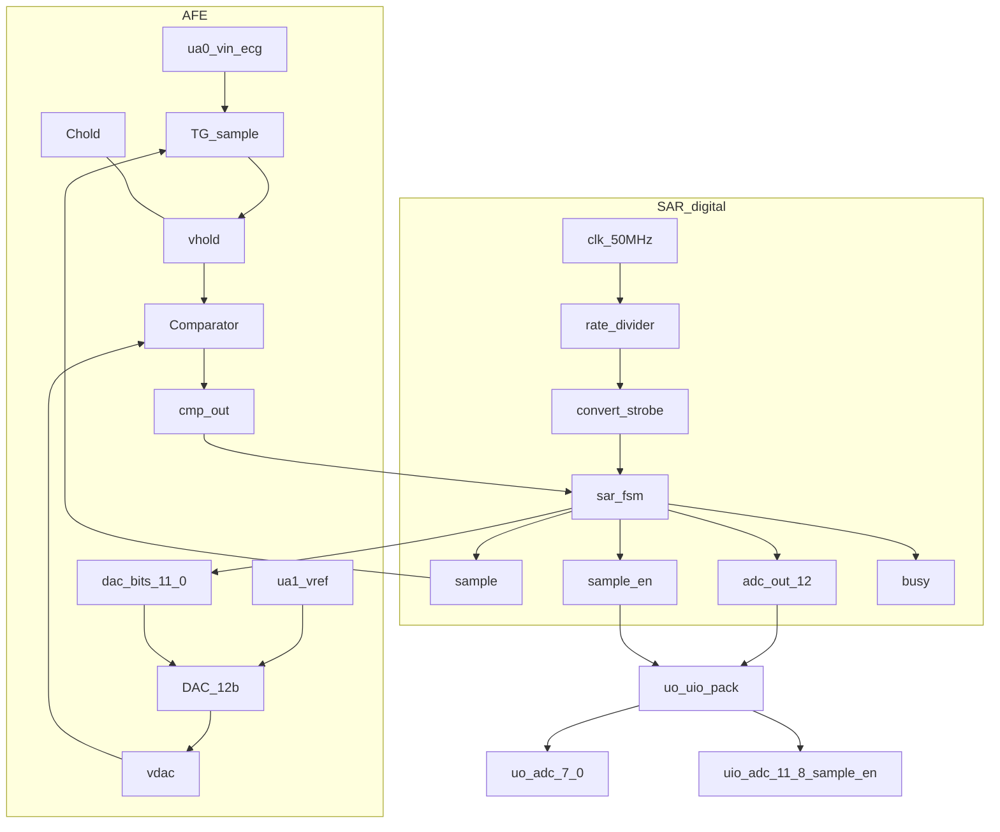
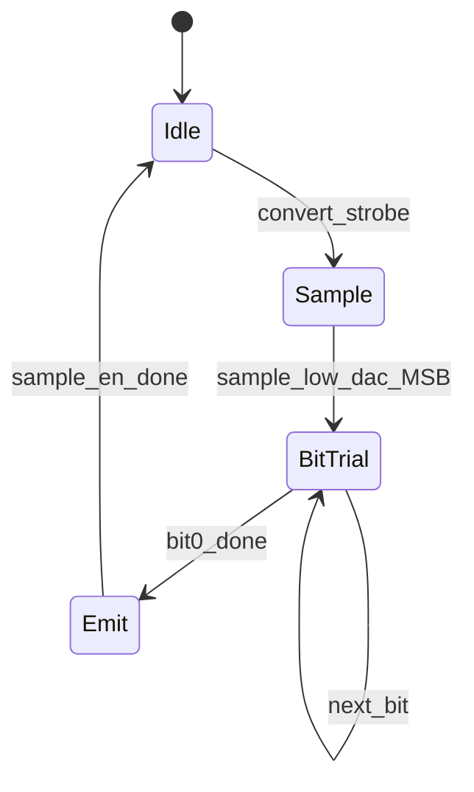
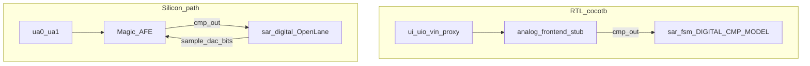
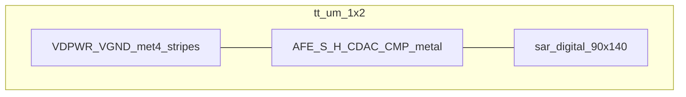

# Architecture — heart_monitor_adc

Mixed-signal **12-bit SAR ADC** for Tiny Tapeout (`tt_um_davidbroughsmyth_ecg_sar12`),
companion to [snn_lif_neurons_ttsky26c](https://github.com/davidbroughsmyth/snn_lif_neurons_ttsky26c).

Datasheet: [info.md](info.md) · Component sheet: [DATASHEET.md](DATASHEET.md) · User manual: [USER_MANUAL.md](USER_MANUAL.md) · Integration: [INTEGRATION.md](INTEGRATION.md)

## System context

External instrumentation amp / bandpass drives `ua[0]`. The ADC tile digitizes at
~500 SPS and presents a parallel 12-bit sample plus `sample_en` for the SNN.

## Mixed-signal block diagram

| Block | Role | Sources |
|---|---|---|
| `rate_divider` | 50 MHz → 500 Hz convert strobe | [`src/rate_divider.v`](../src/rate_divider.v) |
| `sar_fsm` | Track/hold control, 12 MSB-first trials, emit bus | [`src/sar_fsm.v`](../src/sar_fsm.v) |
| AFE | S/H + binary CDAC + comparator | [`analog/sar_afe.spice`](../analog/sar_afe.spice), [`mag/`](../mag/) |
| Stub | Behavioral CMP for cocotb | [`src/analog_frontend_stub.v`](../src/analog_frontend_stub.v) |

## Logical circuit (AFE + SAR digital)

Element-level view of the silicon path: AFE nets feed `sar_digital`
([`src/sar_digital.v`](../src/sar_digital.v) = `rate_divider` + `sar_fsm`).

**AFE elements** ([`analog/sar_afe.spice`](../analog/sar_afe.spice), [`analog/sky130/`](../analog/sky130/)):

- **TG + Chold** — `sample=1` tracks `vin_ecg` onto `vhold`; `sample=0` holds.
- **DAC_12b** — `vref` + `dac_bits[11:0]` → trial voltage `vdac`. Ideal SPICE is a capacitive CDAC; sky130 first-pass SPICE uses an R-2R ladder + TG switches.
- **Comparator** — `cmp_out=1` when `vhold >= vdac`.

**SAR digital elements:**

- **`rate_divider`** — `clk` → `convert_strobe` at 500 SPS (100000 cycles @ 50 MHz).
- **`sar_fsm`** — on strobe: hold, walk bits 11→0, emit `adc_out` and pulse `sample_en` (see [SAR convert sequence](#sar-convert-sequence)).
- **Pad packing** — `uo[7:0]=adc[7:0]`; `uio[3:0]=adc[11:8]`; `uio[4]=sample_en`; `uio_oe=0b00011111`.

## SAR convert sequence

1. **Idle** — `sample=1` (track); wait for `convert_strobe`.
2. **Sample** — `sample=0` (hold); prime `dac_bits` with MSB trial.
3. **BitTrial** — for bits 11…0: settle DAC, sample `cmp_out` (`vin_hold >= dac`), update result.
4. **Emit** — drive `adc_out`, pulse `sample_en` for 4 clocks, return to track.

Production: one convert every `50e6/500 = 100000` clocks. SAR latency is ~12–20 clocks,
so most of the period is idle.

## Sim vs silicon

| Path | Vin | Comparator |
|---|---|---|
| Cocotb | `{uio_in[7:5], ui_in} << 1` | `-DDIGITAL_CMP_MODEL` / stub |
| Silicon | `ua[0]` / `ua[1]` | Layout AFE → `cmp_out` |

Hardened digital macro: [`mag/macros/sar_digital/`](../mag/macros/sar_digital/)
(`src/sar_digital.v` wraps FSM + rate divider, no stub).

## Layout floorplan (1×2)

Approximate regions inside `tt_analog_1x2` (~161 × 226 µm):

- Left: vertical `VDPWR` / `VGND` met4 stripes from DEF init.
- Lower / mid: AFE metal topology (`layout_afe.tcl`); `ua[0]`/`ua[1]` strapped in.
- Upper: OpenLane `sar_digital` child (met4-max, no met5).
- AFE: best-effort `sky130_fd_pr` gencells (not LVS-complete).

Rebuild: `cd mag && make update_gds`. See [`mag/README.md`](../mag/README.md)
(analog custom_gds — not digital `tt_tool` local-harden).

## ECG code mapping

After external gain, aim for baseline mid-scale codes and R-peaks **≥ 2200** so the
SNN segmenter (`R_PEAK_THRESHOLD`) fires. Full demoboard wiring:
[INTEGRATION.md](INTEGRATION.md).
