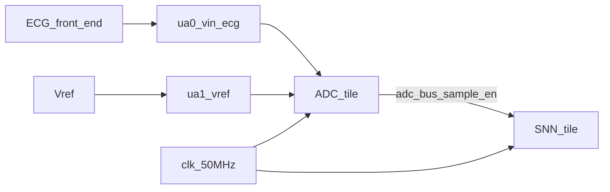
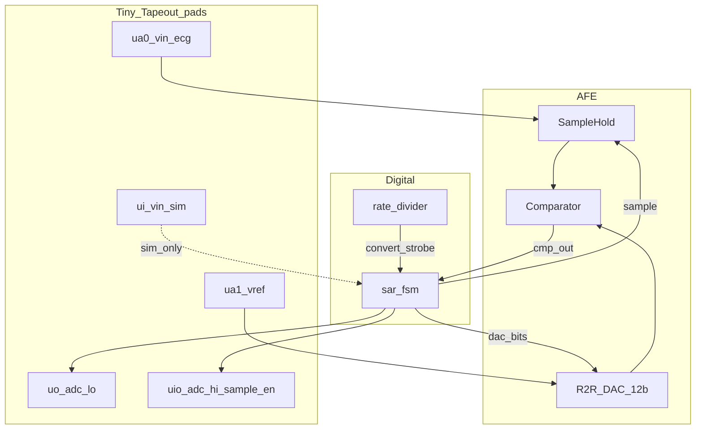
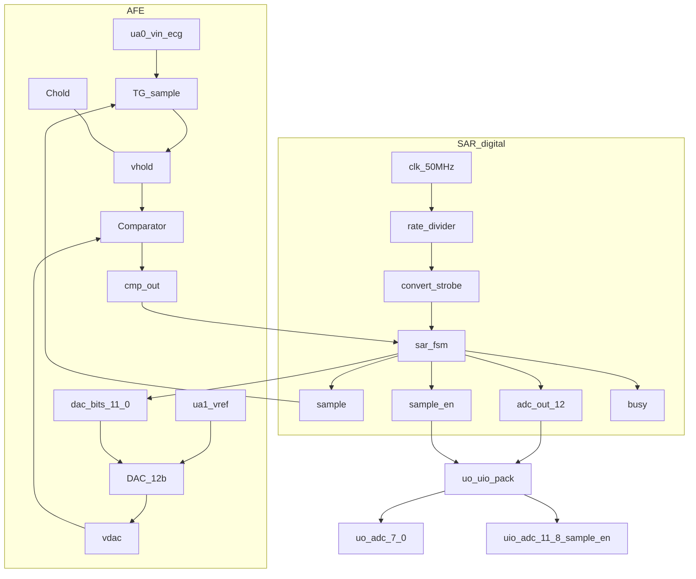
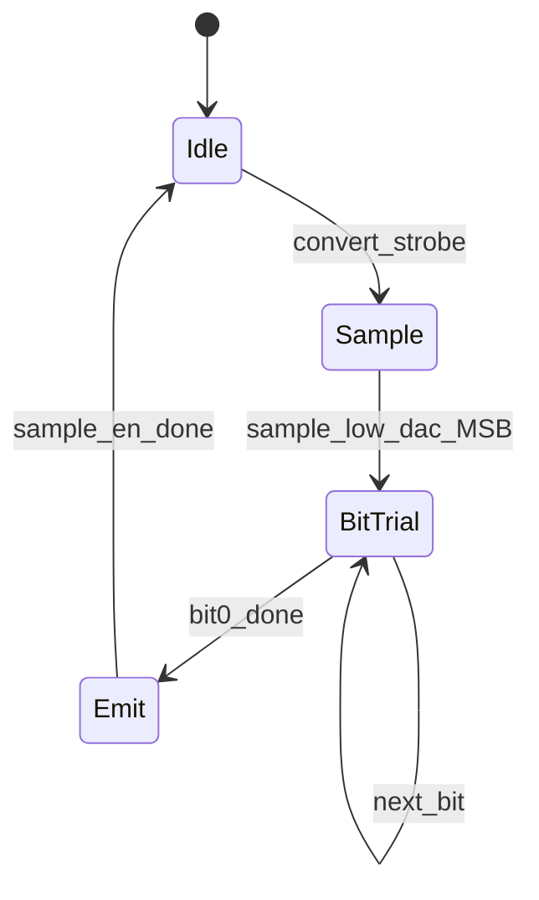
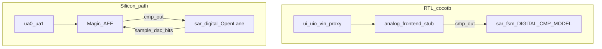
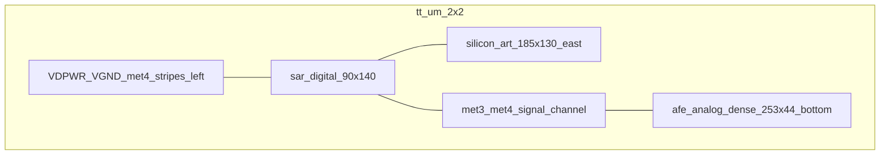

# Architecture — heart_monitor_adc

Mixed-signal **12-bit SAR ADC** for Tiny Tapeout (`tt_um_davidbroughsmyth_ecg_sar12`),
companion to [snn_lif_neurons_ttsky26c](https://github.com/davidbroughsmyth/snn_lif_neurons_ttsky26c).

Datasheet: [info.md](info.md) · Component sheet: [DATASHEET.md](DATASHEET.md) · User manual: [USER_MANUAL.md](USER_MANUAL.md) · Integration: [INTEGRATION.md](INTEGRATION.md) · SAR primer: [HOW_A_SAR_WORKS.md](HOW_A_SAR_WORKS.md)

## System context

External instrumentation amp / bandpass drives `ua[0]`. The ADC tile digitizes at
~500 SPS and presents a parallel 12-bit sample plus `sample_en` for the SNN.

## Mixed-signal block diagram

| Block | Role | Sources |
|---|---|---|
| `rate_divider` | 50 MHz → 500 Hz convert strobe | [`src/rate_divider.v`](../src/rate_divider.v) |
| `sar_fsm` | Track/hold control, 12 MSB-first trials, emit bus | [`src/sar_fsm.v`](../src/sar_fsm.v) |
| AFE | S/H + **R-2R** DAC + comparator | [`analog/sar_afe.spice`](../analog/sar_afe.spice), [`mag/`](../mag/) |
| Stub | Behavioral CMP for cocotb | [`src/analog_frontend_stub.v`](../src/analog_frontend_stub.v) |

## Logical circuit (AFE + SAR digital)

Element-level view of the silicon path: AFE nets feed `sar_digital`
([`src/sar_digital.v`](../src/sar_digital.v) = `rate_divider` + `sar_fsm`).

**AFE elements** ([`analog/sar_afe.spice`](../analog/sar_afe.spice), [`analog/sky130/`](../analog/sky130/)):

- **TG + Chold** — `sample=1` tracks `vin_ecg` onto `vhold`; `sample=0` holds.
- **DAC_12b** — `vref` + `dac_bits[11:0]` → trial voltage `vdac`. This is an **R-2R ladder** (not a capacitive CDAC): per-bit inverter + two TG switches select `vref`/`gnd` into each ladder tap. The sky130 SPICE and the LVS-clean Magic layout (`mag/afe_dac`) use real `sky130_fd_pr__res_xhigh_po_0p35` poly resistors (2R/R).
- **Comparator** — `cmp_out=1` when `vhold >= vdac`.

**SAR digital elements:**

- **`rate_divider`** — `clk` → `convert_strobe` at 500 SPS (100000 cycles @ 50 MHz).
- **`sar_fsm`** — on strobe: hold, walk bits 11→0, emit `adc_out` and pulse `sample_en` (see [SAR convert sequence](#sar-convert-sequence)).
- **Pad packing** — `uo[7:0]=adc[7:0]`; `uio[3:0]=adc[11:8]`; `uio[4]=sample_en`; `uio_oe=0b00011111`.

## SAR convert sequence

1. **Idle** — `sample=1` (track); wait for `convert_strobe`.
2. **Sample** — `sample=0` (hold); prime `dac_bits` with MSB trial.
3. **BitTrial** — for bits 11…0: settle DAC, sample `cmp_out` (`vin_hold >= dac`), update result.
4. **Emit** — drive `adc_out`, pulse `sample_en` for 4 clocks, return to track.

Production: one convert every `50e6/500 = 100000` clocks. SAR latency is ~12–20 clocks,
so most of the period is idle.

## Sim vs silicon

| Path | Vin | Comparator |
|---|---|---|
| Cocotb | `{uio_in[7:5], ui_in} << 1` | `-DDIGITAL_CMP_MODEL` / stub |
| Silicon | `ua[0]` / `ua[1]` | Layout AFE → `cmp_out` |

Hardened digital macro: [`mag/macros/sar_digital/`](../mag/macros/sar_digital/)
(`src/sar_digital.v` wraps FSM + rate divider, no stub).

## Layout floorplan (2×2)

Regions inside `tt_analog_2x2` (**334.88 × 225.76 µm**), assembled by
`mag/build_top_2x2.tcl`:

- Left: vertical `VDPWR` / `VGND` met4 stripes from DEF init.
- Top: OpenLane `sar_digital` child (met4-max, no met5), analog pins (`cmp_out`,
  `sample`, `dac_bits[11:0]`) on its **south edge**, facing down into the channel.
- East of the macro: decorative **`silicon_art`** (185×130 µm) at `(140, 68)` —
  met4 cat faces + hearts + `DBS` signature. Floating metal only (no pins / power);
  no impact on SAR behavior. See [`mag/macros/silicon_art/`](../mag/macros/silicon_art/).
- Bottom: the **dense** AFE `mag/afe_analog_dense` (S/H + comparator + folded
  R-2R DAC), **253 × 44 µm**.
- Between them: a met3-vertical / met4-horizontal channel carries all 14 signals;
  `vin_ecg`→`ua[0]`, `vref`→`ua[1]` drop to the south analog pins, and
  `gnd`/`vdd` tie to the `VGND`/`VDPWR` stripes.
- **Why 2×2 and why "dense":** every `xN2` tile is 225.76 µm tall, so a 140 µm
  macro + AFE + routing channel only fits if the AFE is short. The one-track-per-net
  channel route is short-free but area-heavy: single-row `afe_analog` is ~400 × 66 µm;
  folding the DAC (`afe_analog_folded`) gives 253 × 78 µm; tightening the track
  pitch to 0.5 µm and closing the row gap (`afe_analog_dense`) gives **253 × 44 µm**
  — all three LVS-clean vs `sar_afe.spice`. The dense cell is the one placed on-die.
- **Digital I/O + power:** a second channel **above** the macro routes all 26
  digital boundary nets (`clk`, `rst_n`, `uo_out[7:0]`, `uio_out[7:0]`,
  `uio_oe[7:0]`) from the macro's north pins to the tile's north boundary pins
  (`ui_in`/`uio_in` are sim-only proxies, unused in silicon). Both the AFE supplies
  and the `sar_digital` PDN straps (`VPWR`/`VGND`) are physically bridged to the
  `VDPWR`/`VGND` met4 stripes.
- **Verified:** full-tile DRC is **clean** (KLayout `mr` FEOL+BEOL = 0, Magic
  DRC = 0, including art offgrid snap); hierarchical full-tile connectivity LVS
  (`make top-verify`) confirms every net — analog I/O, the shared DAC/sample/cmp
  bus, all digital I/O to the boundary, and `sar_digital` `VPWR`→`VDPWR` (macro
  powered; no floating supply).

Rebuild: `cd mag && make update_gds`. See [`mag/README.md`](../mag/README.md)
(analog custom_gds — not digital `tt_tool` local-harden).

## ECG code mapping

After external gain, aim for baseline mid-scale codes and R-peaks **≥ 2200** so the
SNN segmenter (`R_PEAK_THRESHOLD`) fires. Full demoboard wiring:
[INTEGRATION.md](INTEGRATION.md).
