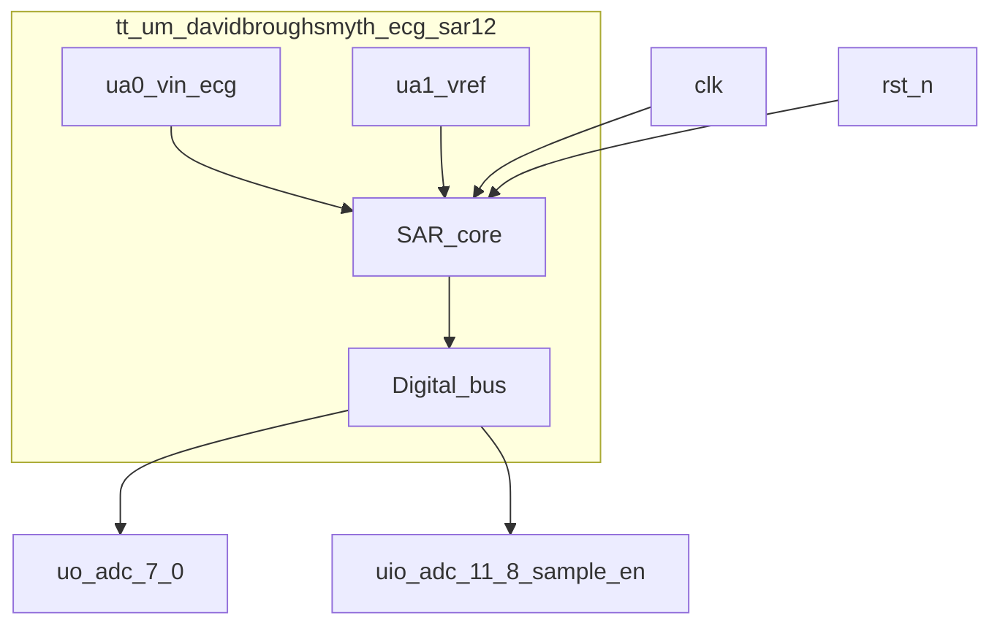
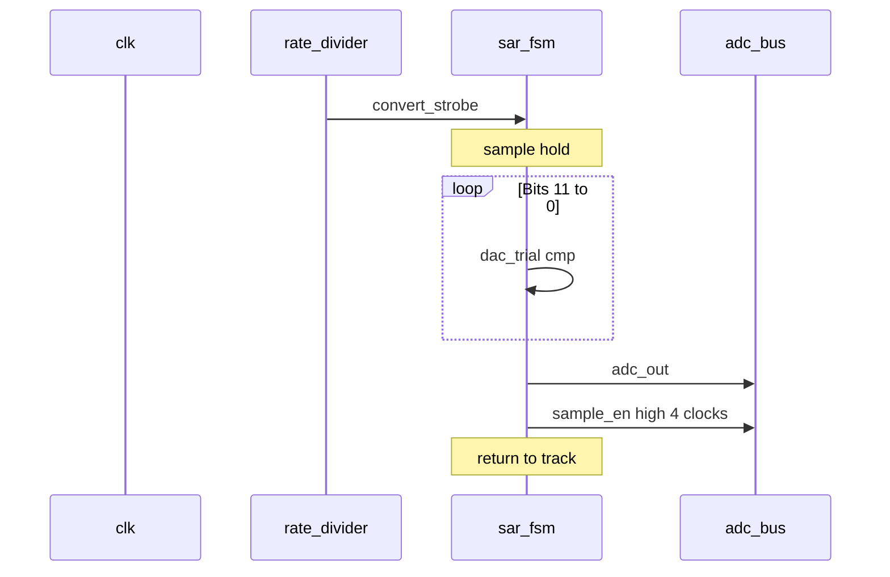
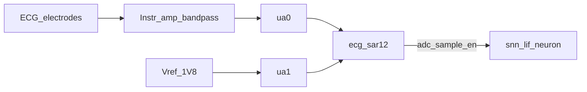

# tt_um_davidbroughsmyth_ecg_sar12

**12-Bit · 500 SPS · Successive-Approximation A/D Converter**

Tiny Tapeout SKY130 · Analog 1×2 tile · Mixed-signal

| | |
|---|---|
| Device | `tt_um_davidbroughsmyth_ecg_sar12` |
| Family | heart_monitor_adc |
| Process | sky130A |
| Package | TT analog tile 1×2 (~161 µm × 226 µm) |
| Analog pins | 2 |

---

## General Description

The **tt_um_davidbroughsmyth_ecg_sar12** is a 12-bit successive-approximation register (SAR)
analog-to-digital converter intended as a companion front-end for a spiking neural-network
heart-monitor tile. A crystal-derived 50 MHz system clock is divided on-chip to a nominal
**500 samples per second** convert rate. Each conversion captures a single-ended ECG input
(`ua[0]`) against an external reference (`ua[1]`), performs twelve MSB-first bit trials, and
presents the result on a parallel digital bus with a `sample_en` strobe compatible with
`tt_um_snn_lif_neuron`.

---

## Features

- 12-bit resolution (codes 0…4095)
- Nominal 500 SPS throughput from 50 MHz `clk`
- On-chip rate divider, SAR FSM, sample/hold, CDAC, and comparator interface
- Parallel output bus: `adc[11:0]` + `sample_en` (SNN-compatible)
- Two analog pads: `vin_ecg`, `vref`
- Digital bring-up path via pin vin proxy (simulation / lab)

---

## Applications

- ECG digitization into Tiny Tapeout SNN classifiers
- Low-rate biomedical / sensor SAR prototypes on sky130
- Two-tile demoboard (ADC + SNN) bring-up

---

## Connection Diagram

### Pin Configuration

| Pin | Name | Type | Function |
|---|---|---|---|
| `ua[0]` | vin_ecg | A | Analog input (conditioned ECG) |
| `ua[1]` | vref | A | Analog reference |
| `uo[7:0]` | adc[7:0] | O | Conversion result, bits 7–0 |
| `uio[3:0]` | adc[11:8] | O | Conversion result, bits 11–8 |
| `uio[4]` | sample_en | O | End-of-conversion strobe (4 clocks) |
| `uio[7:5]` | vin[10:8] | I | Sim-only vin MSBs |
| `ui[7:0]` | vin[7:0] | I | Sim-only vin LSBs |
| `clk` | clk | I | 50 MHz system clock |
| `rst_n` | rst_n | I | Active-low reset |
| `ena` | ena | I | Tile enable (tie high when powered) |
| `VDPWR` | VDPWR | P | 1.8 V digital / core |
| `VGND` | VGND | G | Ground |

A = analog, I = input, O = output, P = power, G = ground.

---

## Absolute Maximum Ratings

Stresses beyond those listed may cause permanent damage. Functional operation is not
implied at these extremes. (SKY130 / Tiny Tapeout guidance — design envelope.)

| Parameter | Symbol | Rating | Unit |
|---|---|---|---|
| Digital supply | VDPWR | −0.3 to 2.0 | V |
| Analog input / reference | Vin, Vref | −0.3 to VDPWR+0.3 | V |
| Digital I/O | — | −0.3 to VDPWR+0.3 | V |
| Analog pad current (path) | Iua | 4 | mA max (TT path) |
| Storage temperature | Tstg | −65 to 150 | °C |

---

## Recommended Operating Conditions

| Parameter | Symbol | Min | Typ | Max | Unit |
|---|---|---|---|---|---|
| Digital supply | VDPWR | 1.62 | 1.80 | 1.98 | V |
| System clock | fclk | — | 50 | — | MHz |
| Analog input range | Vin | 0 | — | Vref | V |
| Reference | Vref | — | 1.80 | VDPWR | V |
| Ambient (lab) | TA | 0 | 25 | 70 | °C |

---

## Electrical Characteristics

VDPWR = 1.8 V, fclk = 50 MHz, Vref = 1.8 V, TA = 25 °C, unless noted.
Values are **design targets** pending silicon characterization.

| Parameter | Symbol | Conditions | Min | Typ | Max | Unit |
|---|---|---|---|---|---|---|
| Resolution | N | — | — | 12 | — | bits |
| Sample rate | fs | production divider | — | 500 | — | SPS |
| Convert period | Tconv | clocks | — | 100000 | — | clk |
| Code range | Dout | — | 0 | — | 4095 | LSB |
| Sim vin packing | — | `{uio[7:5],ui}<<1` | 0 | — | 4094 | LSB even |
| ECG R-peak target | — | after ext. gain | 2200 | — | — | LSB |
| Analog pins used | — | info.yaml | — | 2 | — | — |

INL/DNL, SNR, and power are **TBD** until post-layout / silicon measurement.

---

## Timing Characteristics

| Parameter | Symbol | Min | Typ | Max | Unit |
|---|---|---|---|---|---|
| Clock period | tCLK | — | 20 | — | ns |
| Convert interval | tS | — | 2.0 | — | ms |
| SAR latency | tSAR | 12 | — | 20 | clk |
| sample_en width | tSE | — | 4 | — | clk |
| sample_en to next convert | — | — | ≫ tSAR | — | clk |

### Timing Waveform (one conversion)

---

## Functional Description

**Rate divider.** Divides `clk` to assert `convert_strobe` every 100000 cycles (500 SPS).

**SAR FSM.** On strobe: hold input, walk bits 11→0 comparing held vin to the CDAC trial
code, assemble the 12-bit result, then assert `sample_en` for four clocks.

**Analog front-end.** Sample/hold on `vin_ecg`, binary-weighted CDAC to `vref`, comparator
output `cmp_out` into the FSM. Schematic SPICE: `analog/`; layout: `mag/`.

**Simulation mode.** With `-DDIGITAL_CMP_MODEL`, comparison uses the digital vin proxy;
`analog_frontend_stub` stands in for the AFE.

See [ARCHITECTURE.md](ARCHITECTURE.md) for block diagrams and layout notes.

---

## Typical Application

Wire `uo`/`uio` to the SNN ADC consumer bus; share `clk`, `rst_n`, and GND.
Demoboard detail: [INTEGRATION.md](INTEGRATION.md).

---

## Package Information

| | |
|---|---|
| Form factor | Tiny Tapeout analog template |
| Tile size | 1×2 |
| Approx. area | 161 µm × 226 µm |
| Metal | No user met5 (TT power grid) |
| Supplies | VGND, VDPWR (1.8 V); no VAPWR |

GDS/LEF: `gds/tt_um_davidbroughsmyth_ecg_sar12.gds`,
`lef/tt_um_davidbroughsmyth_ecg_sar12.lef`.

---

## Ordering / Identification

| Field | Value |
|---|---|
| Part / top module | `tt_um_davidbroughsmyth_ecg_sar12` |
| Repository | https://github.com/davidbroughsmyth/heart_monitor_adc_ttsky26c |
| Shuttle family | TTSKY (sky130A) |
| Companion SNN | `tt_um_snn_lif_neuron` |

---

*Preliminary datasheet — design-target electricals. Not a substitute for silicon ATE results.*

TT project sheet: [info.md](info.md)
