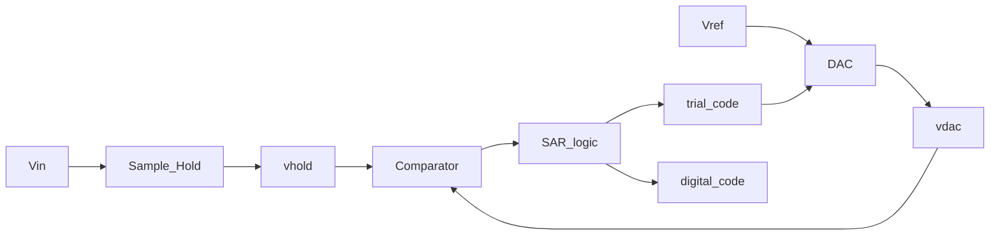
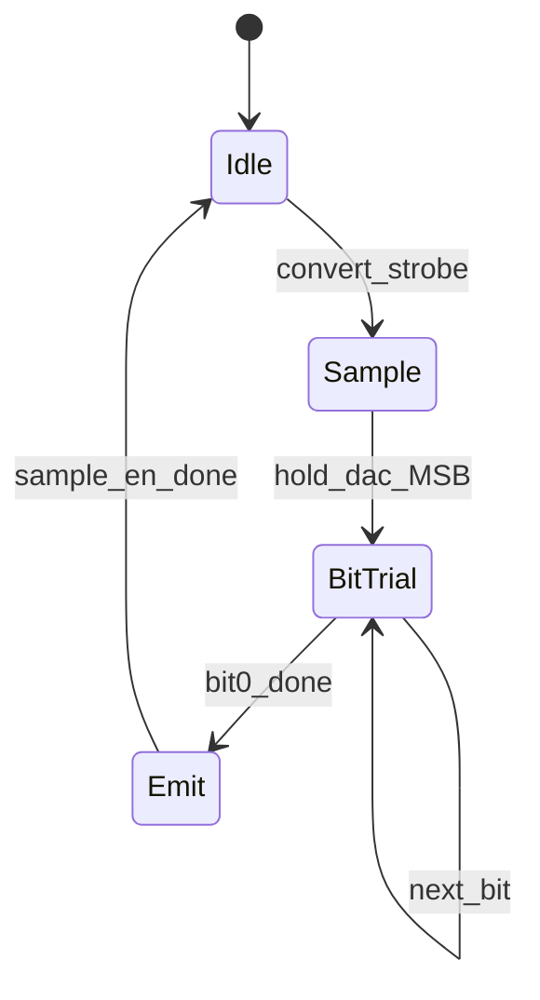

# How a SAR ADC works

A primer on **successive-approximation register (SAR)** analog-to-digital
conversion, with references to how this project (`tt_um_davidbroughsmyth_ecg_sar12`)
implements it.

Related: [ARCHITECTURE.md](ARCHITECTURE.md) · [DATASHEET.md](DATASHEET.md) ·
[INTEGRATION.md](INTEGRATION.md) · analog model [`analog/`](../analog/).

---

## 1. Idea in one line

A SAR ADC finds the digital code for an analog voltage by **binary search**: one
bit per step, most-significant bit (MSB) first. An N-bit result takes **N
comparisons**, not 2^N.

## 2. Building blocks



| Block | Role |
|---|---|
| **Sample/Hold (S/H)** | Freezes `Vin` so it cannot move during the search |
| **DAC** | Turns the current guess code into a trial voltage `vdac` |
| **Comparator** | Answers a yes/no: is `vhold >= vdac`? (one bit) |
| **SAR logic** | Runs the search, stores kept bits, emits the final code |

## 3. The binary-search algorithm

For a 12-bit converter (codes 0..4095), the search converges in 12 steps:

1. **Sample.** S/H tracks `Vin`, then holds it steady.
2. **Guess the MSB.** Set DAC to mid-scale (code `0x800` = 1/2 Vref).
3. **Compare.** If `vhold >= vdac`, that bit stays **1**; otherwise it is **0**.
4. **Add next bit.** OR the next-lower bit into the kept result and compare again.
5. **Repeat** down to bit 0. The accumulated code is the conversion result.

Each comparison halves the remaining voltage window:

```text
Vref  ---------------------------------
        bit11: guess 1000_0000_0000  keep/drop
        bit10: guess ?100_0000_0000  keep/drop
        bit9 : guess ??10_0000_0000  keep/drop
          ...                         ...
        bit0 : guess ????_????_???1  keep/drop
0     ---------------------------------  -> converged code
```

## 4. Worked example (8-bit, Vref = 1.8 V, Vin = 1.0 V)

Target code = round(1.0 / 1.8 x 256) = 142 = `1000_1110`.

| Step | Trial code | vdac (V) | vhold >= vdac? | Bit result |
|---|---|---|---|---|
| b7 | 1000_0000 | 0.900 | yes | 1 |
| b6 | 1100_0000 | 1.350 | no  | 0 |
| b5 | 1010_0000 | 1.125 | no  | 0 |
| b4 | 1001_0000 | 1.013 | no  | 0 |
| b3 | 1000_1000 | 0.956 | yes | 1 |
| b2 | 1000_1100 | 0.984 | yes | 1 |
| b1 | 1000_1110 | 0.998 | yes | 1 |
| b0 | 1000_1111 | 1.005 | no  | 0 |

Result = `1000_1110` = 142. Eight comparisons, done.

## 5. How this project implements it

Digital SAR: [`src/sar_fsm.v`](../src/sar_fsm.v) (+ [`src/rate_divider.v`](../src/rate_divider.v),
wrapped by [`src/sar_digital.v`](../src/sar_digital.v)).

- **`rate_divider`** asserts `convert_strobe` at 500 SPS (50 MHz / 100000).
- **`sar_fsm`** drives `sample` (1 = track, 0 = hold) and `dac_bits[11:0]`, and
  consumes `cmp_out` (`1` = `vhold >= vdac`).
- On each strobe it holds the input, primes the MSB trial `dac_bits = 0x800`,
  walks bits 11 -> 0 keeping or dropping each, then latches `adc_out[11:0]` and
  pulses `sample_en` for four clocks.

The state machine (see [ARCHITECTURE.md](ARCHITECTURE.md#sar-convert-sequence)):



MSB prime, from the FSM:

```80:82:heart_monitor_adc_ttsky26c/src/sar_fsm.v
                    sample   <= 1'b0;
                    dac_bits <= 12'h800;
                    result   <= 12'd0;
```

**Analog front-end.** Ideal SPICE topology in [`analog/sar_afe.spice`](../analog/sar_afe.spice);
sky130 first pass in [`analog/sky130/`](../analog/sky130/) (transmission-gate S/H,
R-2R + TG-switch DAC, diff-pair comparator). In cocotb, `-DDIGITAL_CMP_MODEL`
replaces the comparator with a digital compare against a vin proxy.

## 6. What sets accuracy and speed

- **Speed:** N clocks per sample plus S/H settling. SAR is ideal from ~kSPS to a
  few MSPS; this design targets ~500 SPS for ECG.
- **DAC matching** (capacitor or resistor ratios) sets INL/DNL — the dominant
  error source and the hard part of the analog layout.
- **Comparator offset / noise** shifts or dithers the decision threshold.
- **S/H droop and charge injection** corrupt `vhold` if the search is too slow or
  the switch is poorly sized.

## 7. SAR vs other ADCs

| Type | How | Trade-off |
|---|---|---|
| **SAR** | Binary search, N clocks | Balanced speed/power/area; great for sensors |
| **Flash** | 2^N comparators, 1 step | Very fast, large area/power |
| **Sigma-Delta** | Oversample + noise shaping | High resolution, low bandwidth |
| **Pipeline** | Stages of low-res SAR/flash | High speed at high resolution, more power |

For a low-rate biomedical signal like ECG, SAR is the natural fit: modest speed,
low power, compact.
