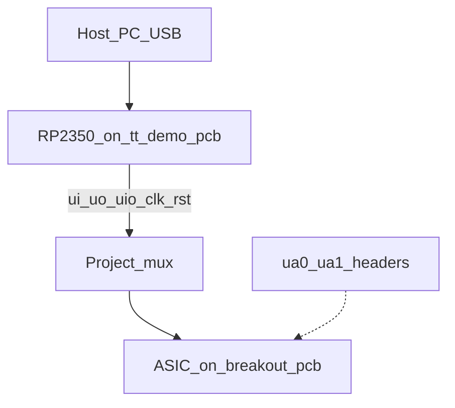
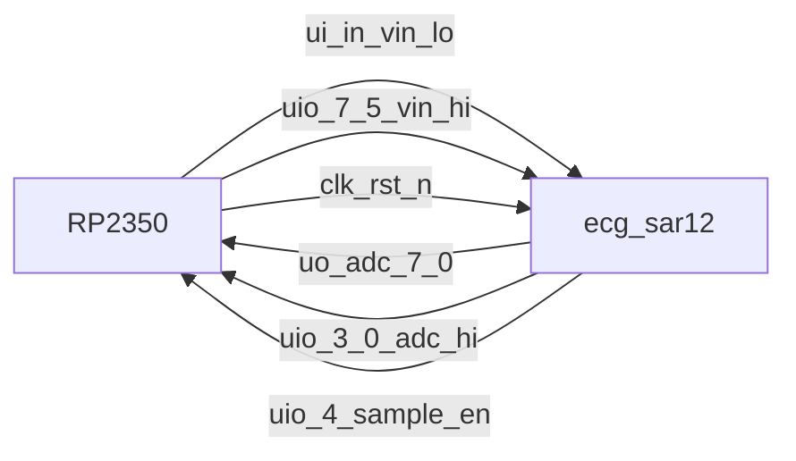
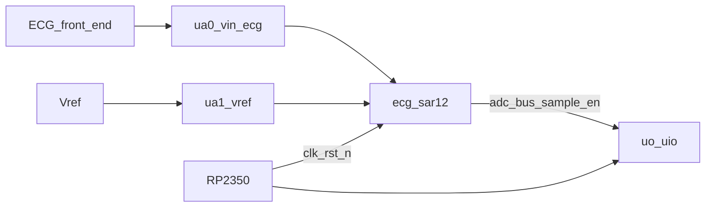
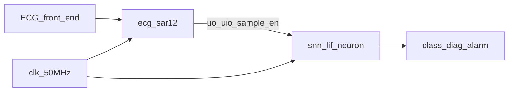
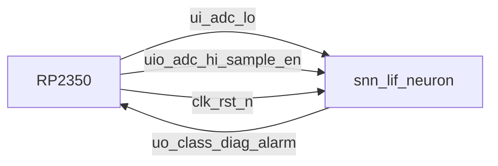
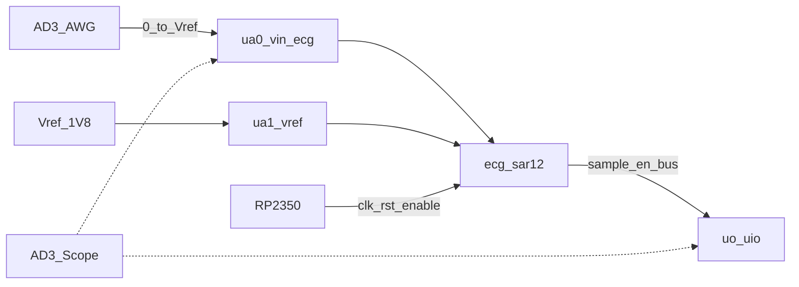

# User Manual — heart_monitor_adc_art on Tiny Tapeout demoboard

How to **use and test** `tt_um_davidbroughsmyth_ecg_sar12` (this **art fork**) alone,
and how to exercise it **together with** `tt_um_snn_lif_neuron` using the RP2350 on
the Tiny Tapeout demo PCB.

**Cosmetic only:** the met4 silicon art east of the digital macro does not change
pinout, timing, or demoboard bring-up vs the pristine
[`heart_monitor_adc_ttsky26c`](https://github.com/davidbroughsmyth/heart_monitor_adc_ttsky26c)
ASIC — same top module name and HIL scripts.

| Doc | Link |
|---|---|
| Architecture | [ARCHITECTURE.md](ARCHITECTURE.md) |
| Component datasheet | [DATASHEET.md](DATASHEET.md) |
| Two-tile wiring | [INTEGRATION.md](INTEGRATION.md) |
| MicroPython HIL scripts | [`../demoboard/`](../demoboard/) |

Firmware / board references:

- [tt-demo-pcb](https://github.com/TinyTapeout/tt-demo-pcb) (RP2350 demoboard)
- [breakout-pcb](https://github.com/TinyTapeout/breakout-pcb) (ASIC carrier)
- [tt-micropython-firmware](https://github.com/TinyTapeout/tt-micropython-firmware) (DemoBoard SDK + examples)
- [Analog Discovery guide](https://tinytapeout.com/guides/analog-discovery/) (WaveForms / AD3 bench)
- [Local hardening](https://tinytapeout.com/guides/local-hardening/) (digital tops only — this ADC uses custom GDS; see `mag/README.md`)

---

## 1. Hardware stack



1. ASIC sits on the **breakout**; breakout plugs into the **demoboard**.
2. Install a current **RP2350 UF2** from firmware [releases](https://github.com/TinyTapeout/tt-micropython-firmware/releases) (hold BOOT, copy UF2).
3. Open a serial REPL (`/dev/ttyACM0` or similar). A `tt` / `DemoBoard` object is available after boot.

### Mux limitation (important)

The shuttle **enables one design at a time**. The RP2350 only drives/reads that design’s digital pins.

| Scenario | Enabled project | What the RP2350 does |
|---|---|---|
| ADC alone | `tt_um_davidbroughsmyth_ecg_sar12` | Drive digital vin proxy; read ADC bus + `sample_en` |
| Combined HIL | `tt_um_snn_lif_neuron` | **Emulate** the ADC (samples + `sample_en`); read class / alarm |
| Two-tile silicon | both on chip, external wiring | See [INTEGRATION.md](INTEGRATION.md); not via mux simultaneously |

---

## 2. Circuit diagrams

### 2.1 ADC alone (digital bring-up path)



Vin packing (same as cocotb): `{uio_in[7:5], ui_in} << 1` → even codes 0…4094.

**Bidirectional OE:** ASIC `uio_oe[4:0]=1` (ADC drives). On the Pico set:

`tt.uio_oe_pico.value = 0b11100000`  
(drive vin MSBs on [7:5]; read [4:0]).

### 2.2 ADC alone (silicon analog path)



Analog headers on the breakout/demoboard route to `ua[0]`/`ua[1]`. Digital vin pins are unused for true analog stimulus.

### 2.3 Combined — logical (post-silicon tile wiring)



Physical pin map: [INTEGRATION.md](INTEGRATION.md).

### 2.4 Combined — demoboard HIL (RP emulates ADC)



Enable **only** the SNN. Scripts in `demoboard/tt_um_snn_lif_neuron/` synthesize baseline → R-peak → morphology.

---

## 3. Using the ADC alone

### 3.1 REPL smoke

```python
from ttboard.demoboard import DemoBoard
from ttboard.mode import RPMode

tt = DemoBoard.get()
tt.mode = RPMode.ASIC_RP_CONTROL
tt.shuttle.tt_um_davidbroughsmyth_ecg_sar12.enable()
# If name missing: tt.shuttle.find('ecg_sar')[0].enable()

tt.uio_oe_pico.value = 0b11100000
tt.reset_project(True)
tt.reset_project(False)
tt.clock_project_PWM(1_000_000)  # 1 MHz project clock

# Mid-scale vin 0x800 → packed = 0x400
tt.ui_in.value = 0x00
tt.uio_in.value = 0x80  # uio[7]=1 → packed[10]=1 → code bit11 after <<1 … use encode helper
# Prefer:
#   from examples.tt_um_davidbroughsmyth_ecg_sar12.tt_um_davidbroughsmyth_ecg_sar12 import encode_vin_pins
#   ui, uio = encode_vin_pins(0x800); tt.ui_in.value = ui; tt.uio_in.value = uio
```

Safer: use the packaged test (encodes vin correctly):

```python
import examples.tt_um_davidbroughsmyth_ecg_sar12 as adc_hil
adc_hil.run()
```

### 3.2 Desktop RTL / SPICE (no ASIC)

```sh
cd test && make -B          # cocotb, FAST_SIM
cd analog && ./run_tb.sh    # ngspice AFE polarity
```

### 3.3 What to expect

- After reset and enough clocks, `uio_out[4]` (`sample_en`) pulses.
- `uo_out` + `uio_out[3:0]` hold the 12-bit code (even codes on digital proxy).
- Production silicon rate is 500 SPS at 50 MHz; HIL often uses a slower/faster RP-driven clock — wait for `sample_en` rather than assuming wall time.

### 3.4 Bench instruments (Analog Discovery)

For the **silicon analog path**, an AD3 (or any AWG/scope) can drive and probe `ua[]`. Full WaveForms walkthrough: [TT Analog Discovery guide](https://tinytapeout.com/guides/analog-discovery/).



1. Common **GND** between AD3 and demoboard.
2. AWG → analog header for `ua[0]`; keep stimulus in **0 … Vref** (typ Vref = 1.8 V). Do not use the AD3’s full bipolar range into `ua`.
3. `ua[1]` = fixed Vref (~1.8 V), not an AWG sweep.
4. Enable the ADC project; clock/`rst_n` from RP (`ASIC_RP_CONTROL`). Trigger the scope/LA on `sample_en` (`uio[4]`).
5. QRS recipe for SNN thresholds: baseline mid-low, R-peak so code ≥ 2200 (≈ **0.97 V** at Vref=1.8 V).
6. If AD3 **Patterns** drive the digital vin proxy: `tt.mode = RPMode.ASIC_MANUAL_INPUTS` so RP and AD3 do not fight; High-Z DIO during demoboard USB boot (see guide `powerupHighZ`).
7. Optional core supply via AD3 V+ (remove F2) is for characterization only — see the TT guide; not needed for routine ADC bring-up.

MicroPython HIL (§3.1) needs no AWG; AD3 is for real `ua` stimulus / measurement.

---

## 4. Combined with the SNN (HIL)

### 4.1 Pin map (ADC producer → SNN consumer)

| ADC | SNN |
|---|---|
| `uo[7:0]` adc[7:0] | `ui_in[7:0]` |
| `uio[3:0]` adc[11:8] | `uio_in[3:0]` |
| `uio[4]` sample_en | `uio_in[4]` |

### 4.2 HIL procedure

1. Enable `tt_um_snn_lif_neuron`.
2. Set `uio_oe_pico = 0xFF` (RP drives all bidirs used as ADC bus + sample_en).
3. Hold baseline ~150, then R-peak ≥ 2200, then gentle-rise morphology for ~100 samples.
4. On `uo[3]` (`diag_valid`), read `uo[2:0]` class (expect 0 for gentle rise).
5. Optional: three ventricular (steep rise, class 2) beats → `uo[4]` alarm.

```python
import examples.tt_um_snn_lif_neuron as snn_hil
snn_hil.run()
```

### 4.3 Two-tile silicon

When both designs are on the chip and wired per INTEGRATION, use external ECG into ADC `ua[0]`, share `clk`/`rst_n`, and observe SNN outputs (via a second demoboard path or instrumentation). The mux still only exposes one project’s pins to the RP at a time.

---

## 5. Installing MicroPython tests

From a host with [mpremote](https://docs.micropython.org/en/latest/reference/mpremote.html):

```sh
pip install --user mpremote
# Copy packages onto the RP2 filesystem (adjust port)
mpremote connect list
mpremote fs mkdir :/examples
mpremote fs cp -r demoboard/tt_um_davidbroughsmyth_ecg_sar12 :/examples/
mpremote fs cp -r demoboard/tt_um_snn_lif_neuron :/examples/
mpremote reset
```

On the REPL (if your firmware already vendors `examples/`):

```python
import examples.tt_um_davidbroughsmyth_ecg_sar12 as t
t.run()
```

Scripts follow the same style as
[tt_um_factory_test.py](https://github.com/TinyTapeout/tt-micropython-firmware/blob/main/src/examples/tt_um_factory_test/tt_um_factory_test.py):
`@cocotb.test()`, `DemoBoard.get()`, black-box I/O only.

---

## 6. Troubleshooting

| Symptom | Check |
|---|---|
| Project missing | `tt.shuttle.find('sar')` / `find('snn')` — shuttle JSON must list your design |
| No `sample_en` | Clock running? Reset released? Vin latched while idle? |
| Bus X / stuck | `tt.mode = RPMode.ASIC_RP_CONTROL`; fix `uio_oe_pico` mirror |
| Wrong ADC code | Even codes only on digital proxy; use `encode_vin_pins` |
| SNN never `diag_valid` | Need R-peak ≥ 2200 then ~100 morphology samples with `sample_en` |
| Alarm never fires | Need 3 consecutive classes in {1,2,4}; 0/3 clear the streak |

---

## 7. Quick reference — OE and packing

```text
ADC ASIC uio_oe = 0b00011111
Pico      uio_oe_pico = 0b11100000

vin_code (even) → packed = code >> 1
  ui_in      = packed[7:0]
  uio_in[7:5] = packed[10:8]
```
