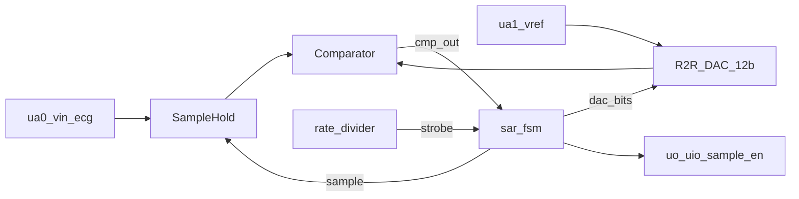

<!---
Tiny Tapeout datasheet — heart_monitor_adc / tt_um_davidbroughsmyth_ecg_sar12
-->

# heart_monitor_adc

12-bit ~500 SPS successive-approximation (SAR) ADC companion for the
[SNN heart monitor](https://github.com/davidbroughsmyth/snn_lif_neurons_ttsky26c).

| | |
|---|---|
| Top module | `tt_um_davidbroughsmyth_ecg_sar12` |
| Tiles | 2×2 |
| Analog pins | 2 (`ua[0]` vin_ecg, `ua[1]` vref) |
| Clock | 50 MHz |
| Sample rate | 500 SPS (production) |
| Resolution | 12-bit |

Architecture details: [ARCHITECTURE.md](ARCHITECTURE.md) ·
Component datasheet (databook style): [DATASHEET.md](DATASHEET.md) ·
User manual (demoboard / HIL): [USER_MANUAL.md](USER_MANUAL.md) ·
Demoboard wiring: [INTEGRATION.md](INTEGRATION.md)

## Features

- Binary-search SAR with sample/hold, 12-bit R-2R DAC, and comparator interface
- Digital bus matches SNN ADC consumer (`uo` / `uio` + `sample_en`)
- RTL sim path via pin vin proxy + behavioral comparator (no SPICE required)
- Silicon path: Magic AFE + OpenLane-hardened `sar_digital` on TT analog template

## Block diagram



## How it works

1. **`rate_divider`** derives a convert strobe at **500 SPS** from `clk`
   (`50e6 / 500 = 100000` cycles). Cocotb uses `FAST_SIM` (~250 kSPS) only.
2. On each strobe, **`sar_fsm`** holds the input and runs 12 MSB-first bit trials.
3. The 12-bit result is driven on the SNN-compatible bus and **`sample_en` is pulsed**
   for 4 clocks.

| ADC output | SNN input |
|---|---|
| `uo[7:0]` = `adc[7:0]` | `ui_in[7:0]` |
| `uio[3:0]` = `adc[11:8]` | `uio_in[3:0]` |
| `uio[4]` = `sample_en` | `uio_in[4]` |

**Silicon:** `ua[0]` = `vin_ecg`, `ua[1]` = `vref`. Ideal SPICE AFE in
[`analog/`](../analog/).

**Digital sim:** `{uio_in[7:5], ui_in} << 1` (even codes 0…4094) with
`-DDIGITAL_CMP_MODEL` and [`analog_frontend_stub.v`](../src/analog_frontend_stub.v).

Target ECG mapping (after external gain): R-peaks **≥ 2200** for the SNN peak threshold.

## Pinout

### Analog

| Pin | Name | Direction | Description |
|---|---|---|---|
| `ua[0]` | vin_ecg | inout | Conditioned single-ended ECG |
| `ua[1]` | vref | inout | SAR reference |

### Digital outputs (ADC → SNN)

| Pin | Name | Description |
|---|---|---|
| `uo[7:0]` | adc[7:0] | Sample LSBs |
| `uio[3:0]` | adc[11:8] | Sample MSBs (`uio_oe` driven) |
| `uio[4]` | sample_en | New-sample strobe (`uio_oe` driven) |

### Digital inputs (sim / unused on silicon)

| Pin | Name | Description |
|---|---|---|
| `ui[7:0]` | vin[7:0] | Sim vin LSBs |
| `uio[7:5]` | vin[10:8] | Sim vin MSBs (inputs) |

## Timing

| Parameter | Value |
|---|---|
| `clk` | 50 MHz |
| Convert period | 100000 clocks ≈ 2 ms (500 SPS) |
| SAR latency | ~12–20 clocks |
| `sample_en` width | 4 clocks |

## How to test

```sh
cd test
python3.13 -m venv .venv && source .venv/bin/activate
pip install -r requirements.txt
make -B
```

Cocotb: `uio_oe` contract, SAR code tracking, `sample_en` period under `FAST_SIM`.

```sh
cd analog && ./run_tb.sh   # ngspice AFE comparator polarity
```

## External hardware

- **ECG front-end** (instrumentation amp + ~0.5–40 Hz bandpass) into `ua[0]`.
- Lab: AWG / [Analog Discovery](https://tinytapeout.com/guides/analog-discovery/) into `ua[0]` (0…Vref); see [USER_MANUAL.md §3.4](USER_MANUAL.md#34-bench-instruments-analog-discovery).
- Wire this tile’s ADC bus to `tt_um_snn_lif_neuron`; share `clk`, `rst_n`, GND.
- Optional lab path: MCU + commercial 12-bit SAR on the same digital bus.

See [INTEGRATION.md](INTEGRATION.md). Hardening notes: [mag/README.md](../mag/README.md).
